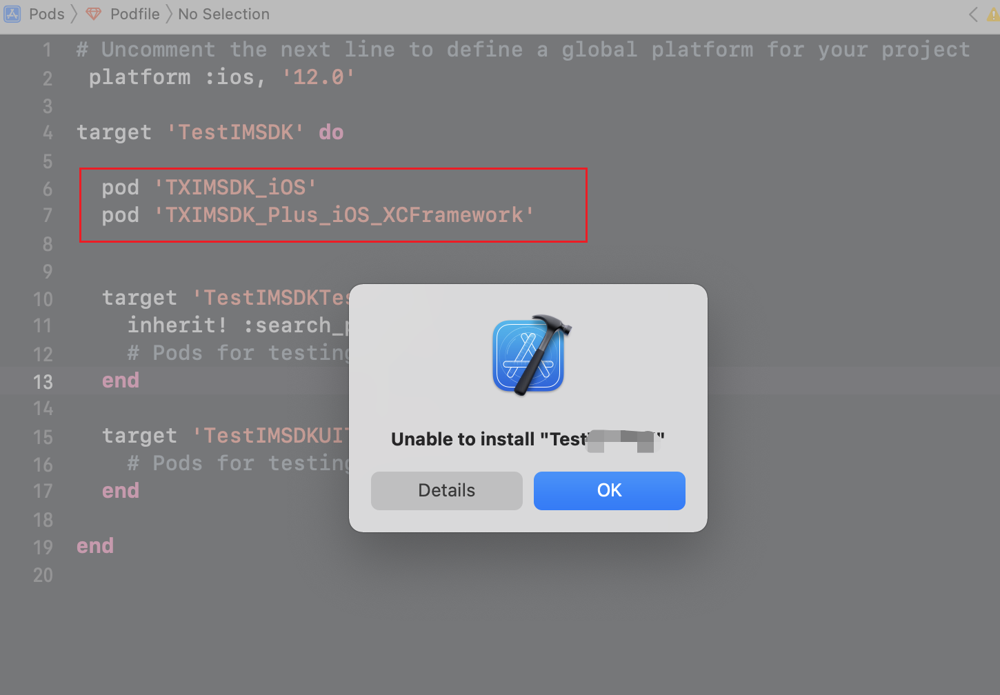

> ###前言
> 在发布一个sdk时，发现在一个项目里能正常运行，换了一个项目后就报`Unable to install xxxx`,报错如下

参考资料：  
[Xcode真机调试之unable to install](https://www.jianshu.com/p/1e776dface06)  
[集成 腾讯IMSDK（iOS）](https://cloud.tencent.com/document/product/269/32675)  

警告对比研究，发现时因为报错的项目已经引入了`TXIMSDK_iOS`，而引入的新sdk又引入了`TXIMSDK_Plus_iOS`，这两个SDK同时引入时就冲突报错了，

###解决方案：（统一成引入同一个imsdk）
####方案一：
幸好其中一个引入了`TXIMSDK_iOS`的SDK已经没使用了，去掉就能正常运行起来了
####后续方案二：
需要在提供的sdk里增加使用`TXIMSDK_iOS`和`TXIMSDK_Plus_iOS`两种版本可供选择，毕竟难以预料接入方会接入哪些sdk

思考：作为SDK提供方，理论上是需要考虑接入方会遇到这种同时集成两个SDK的情况，而且腾讯的SDK作为基础版和增强版，不是递进依赖，而是独立的sdk，两个sdk还会冲突，这种情况估计是sdk提供方长期脱离业务接入，对这种情况考虑不足，同时在写sdk时，一定要尽量多的考虑接入场景的多样化